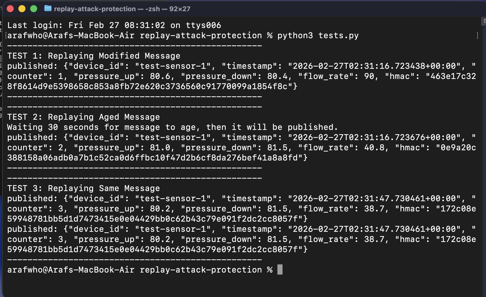
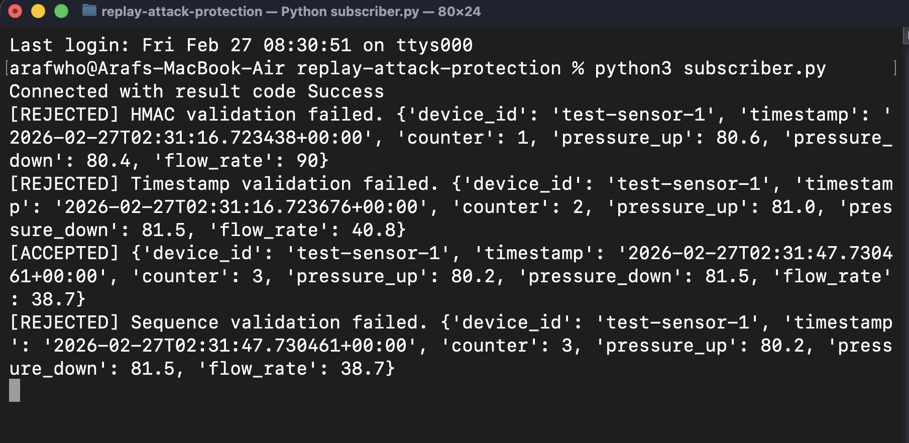
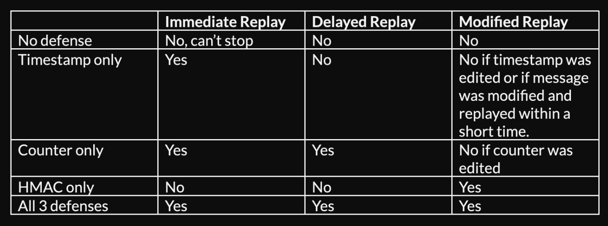

# Overview
On top of our mTLS pipeline, we will add replay attack protection (hmac signature, timestamp, sequence numbers validated). This blocks replayed messaged.

# Protections added to pipeline
1. HMAC signature (modified messages blocked).
2. Timestamp validation (aged messages blocked).
3. Sequence number validation (seen before messages blocked). 

# Set up instructions
### 0. Prerequisites
* Generate certificates and keys using [commands](../secure-pipeline-mtls/generate-keys-certs.md).
* Run mosquitto broker ```mosquitto -c mosquitto-mtls.conf -v```
* Create shared key for hmac signature: create a .env file at root directory with this inside: ```SHARED_SECRET = your_secret_here```

### 1. Upgrade [publisher.py](publisher.py)
For every message, publisher will generate unique hmac signature, timestamp, sequence number.
A shared secret is set between publisher and subscriber for hmac signature computation. We stored this secret as a variable in development, however it should be secured tightly in production. If the secret is exposed, hmac breaks down.

### 2. Upgrade [subscriber.py](subscriber.py)
For every message, subscriber will validate:
* hmac signature
* timestamp
* sequence numbers

If recomputed hmac signature doesn't match > message was modified; rejected.
If message is too old > message rejected.
If message sequence number has been used before for that device > message rejected.

# Security Tests
### [tests.py](tests.py) view:


### [subscriber.py](subscriber.py) view:
With all 3 defenses, all of the replayed messages were successfully rejected.


### Test Findings
Can defenses stop immediate, delayed, modified replay attacks?


Individually, these 3 protections (hmac, timestamp, sequence counter) all have gaps. However, when used together, they fill each other's gap and provide strong replay protection.

# Trade Offs
### HMAC signature validation:
Low, performance impact as a hash takes only takes milliseconds to compute, especially for low byte IoT messages. 
### Timestamp validation:
Low, only a single subtraction needed.
### Sequence counter validation:
Low, only a dictionary lookup needed. Python uses hash tables which take constant O(1) for lookups, regardless of how many devices we have.
### All 3 together:
Still low, all operations are fast.