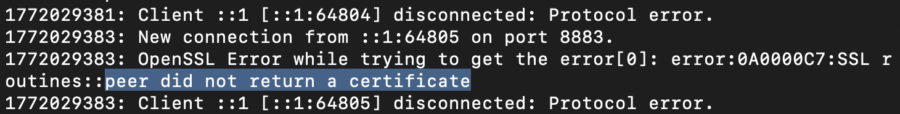
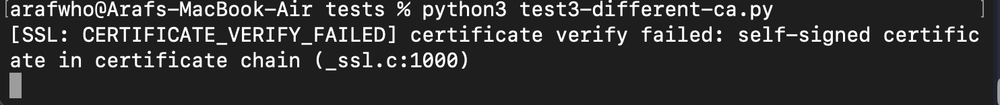
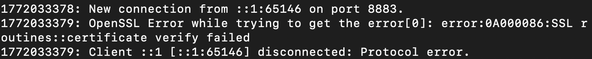

# Overview
On top of our TLS pipeline, we will add mTLS for device authentication. After device verifies broker's identity, broker will verify device identity before accepting readings. This prevents attackers from setting up a fake sensor and sending fake readings and dangerous commands.

# Protection added to pipeline:
1. Authentication of devices (sensors and dashboards have to prove they are not an imposter)

# mTLS Handshake Overview
1. Device will send hello to server (mosquitto broker).

2. Broker will send its server certificate.

3. Device will use CA certificate to check if the server certificate is signed by  CA.

4. Now device will send its certificate to server.

3. Now server will use CA certificate to check if the device certificate is signed by CA.

6. Encrypted data will be sent using the other entities' public key, which can only be decrypted by the other entities' private key. This makes sure only the real client/holding their private key can decrypt data.

# Set up instructions
### 1. Generate key and certificates
Generate key and certificate for CA, server and 2 devices (sensor1, dashboard1) using openSSL:
[generate-keys-certs.md](generate-keys-certs.md)

### 2. Configure Mosquitto Broker to Use Certificates
Put [mosquitto-mtls.conf](mosquitto-mtls.conf) file in directory. This file will tell mosquitto broker to require device authenticate and not allow anonymous users.
```
allow_anonymous false
require_certificate true
```

### 3. Upgrade subscriber.py and publisher.py to use mTLS
We provide path to CA certificate, device certificate, device private key. 

publisher.py:
```
mqttc.tls_set('certs/ca.pem','certs/sensor1.pem','certs/sensor1-key.pem')
```

subscriber.py:
```
mqttc.tls_set('certs/ca.pem','certs/dashboard1.pem','certs/dashboard1-key.pem')
```

### 4. Test if mTLS is working


Start mosquitto broker with mTLS configuration (provide proper path to conf file):
```
mosquitto -c mosquitto-mtls.conf -v      
```

On another terminal, run publisher.py:
```
python3 publisher.py
```  
This will start publishing readings.

On another terminal, run subscriber.py:
```
python3 subscriber.py
```
We will start seeing readings from publisher. Visually, this looks same, however, now broker and devices verify each other and readings are encrypted.

# Security Tests
### Test 1: Can a device with a valid certificate connect?
Ran subcriber.py that points to a device certificate that's signed by the root CA. 
```
mqttc.tls_set('../certs/ca.pem', '../certs/sensor1.pem','../certs/sensor1-key.pem')
```
Successfully connected, test passed.

### Test 2: Can a device with no certificate connect?
Run [tests/test2-no-cert.py](tests/test2-no-cert.py) that only points to a CA certificate (no device certificate or key).
```
mqttc.tls_set('../certs/ca.pem')
```
Error: peer did not return a certificate. Broker rejected the connection, test passed.



### Test 3: Can a device with a certificate from a different CA connect?
Generate differerent CA key, cert and device key, certificate (signed by different CA): [tests/generate-test-keys-certs.md](tests/generate-test-keys-certs.md)

Run [tests/test3-different-ca.py](tests/test2-no-cert.py) that points to a device certificate signed by a different CA (not trusted by broker).



[SSL: CERTIFICATE_VERIFY_FAILED] certificate verify failed: self-signed certificate in certificate chain (_ssl.c:1000)

Test passed.

### Test 4: Can a device with an expired certificate connect?
Generate expired certificate: [generate-test-keys-certs.md](generate-test-keys-certs.md)

Run [tests/test4-expired-cert.py](tests/test4-expired-cert.py) that points to a an expired device certificate signed by the trusted CA.



OpenSSL Error while trying to get the error[0]: error:0A000086:SSL routines::certificate verify failed.

Broker rejected the connection. Test passed.

# Cost
Adding mTLS has a connection time overhead. While making the connection, there’s an extra step (server has to verify client). This increase connection time, however, it is a one time cost. Sensors don’t need to connect again for hours or days. Once connection is established, there’s no extra message latency. In our environment, the benefits of mTLS outweigh this cost. 