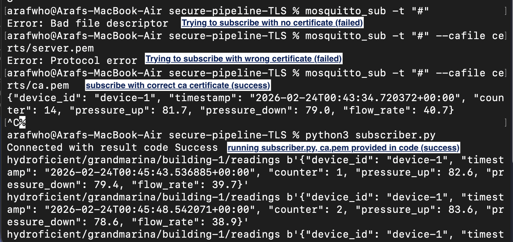

# Overview
On top of our insecure pipeline, we will add one way TLS for encryption and broker authentication. The subscriber, publisher will verify the broker's identity before transferring readings. This prevents attackers from setting up a fake broker and stealing readings from sensors. Additionally, readings will be encrypted in transit so anyone other than the broker can't view our data.

# Protections added to pipeline:
1. Encryption
2. Authentication (server or/and client proves they are not an imposter) (authN is done using digital certificates, it proves identity)
3. Data modification in transit protection (message integrity check)

# One Way TLS Handshake Overview
1. Sensor will send hello to mosquitto broker.

2. Broker will send its server certificate.

3. Sensor will use CA certificate to check if the server certificate is signed by the CA.

4. If yes, that means the CA vouches for the broker's identity, it is legit. Communication will be established and readings will be encrypted/decrypted using a shared shared symmetric key. If no, broker will be deemed fake and communication will be rejected.

# Set up instructions
### 1. Generate key and certificates
Generate CA key and self signed certificate:
```
openssl genrsa -out ca-key.pem 2048
openssl req -x509 -new -nodes -key ca-key.pem -subj "/CN=VPN CA" -days 3650 -out ca.pem
```
Generate server key and certificate (signed by CA):
```
openssl genrsa -out "server-key.pem" 2048

openssl req -new -key "server-key.pem" -out "server-req.pem" -subj "/CN=server"

openssl x509 -req -days 365 -in "server-req.pem" -CA ca.pem -CAkey ca-key.pem -CAcreateserial -out "server.pem" -extfile <(echo -e "subjectAltName=DNS:localhost\nextendedKeyUsage=serverAuth")
```

### 2. Configure Mosquitto Broker to Use Certificates
Create mosquitto-tls.conf file and provide certificates, key:
```
listener 8883

cafile certs/ca.pem
certfile certs/server.pem
keyfile certs/server-key.pem

allow_anonymous true
require_certificate false
```

### 3. Upgrade subscriber.py and publisher.py to use TLS
Change this line to connect over port 8883 (MQTTS) instead of 1883.
```
mqttc.connect("localhost", 8883)
```

Add this line to provide CA certificate path:
```
mqttc.tls_set('certs/ca.pem')
```

### 4. Test if TLS is working
Start mosquitto broker with TLS configuration (provide proper path to conf file):
```
mosquitto -c mosquitto-tls.conf -v      
```

On another terminal, run publisher.py:
```
python3 publisher.py
```  
This will start publishing readings.

On another terminal, run subscriber.py:
```
python3 subscriber.py
```
We will start seeing readings from publisher. Visually, this looks same as our insecure pipeline, however, now broker is authenticated and readings are encrypted.

# Testing TLS


Tests passed:
* Eavesdropping (no ca certificate)
* Expired certificate test
* Wrong certificate

# Vulnerability
In this set up, only the broker is being authenticated, not the sensor. That means anyone with the CA certificate can create a fake sensor and send fake readings to broker. In mTLS (mutual TLS), both broker and sensors will be authenticated using CA's signature.