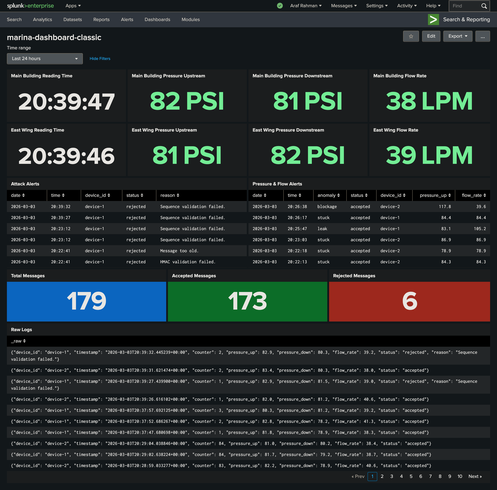

# Splunk Dashboard

# Security Added to Pipeline
* Live monitoring of sensor readings (pressure upstream, downstream, flow rate) in 2 different blocks.
* View rejected attack attempts.
* View water system issues (leaks, blockage, stuck sensor)
* View total processed, accepted, rejected messages in a time range.

# How it Works
1. Subscriber appends received messages to messages.json file. 
2. Splunk monitors this json file and ingests new readings. 
3. Splunk uses SPL queries to display data in dashboard.

# Activate live monitoring
1. Splunk:
    * Download Splunk Enterprise
    * Create index: grand-marina-hotel
    * Set up messages.json local file monitoring and dump to grand-marina-hotel index.
    * Create dashboard, paste source code: [splunk_dashboard_source.html](splunk_dashboard_source.html)
2. Run mosquitto broker
3. Run [subscriber.py](subscriber.py)
4. Run [publisher_device1.py](publisher_device1.py) and [publisher_device2.py](publisher_device2.py) to view live readings.
5. Run [simulate_attacks.py](simulate_attacks.py) to simulate attack alerts.