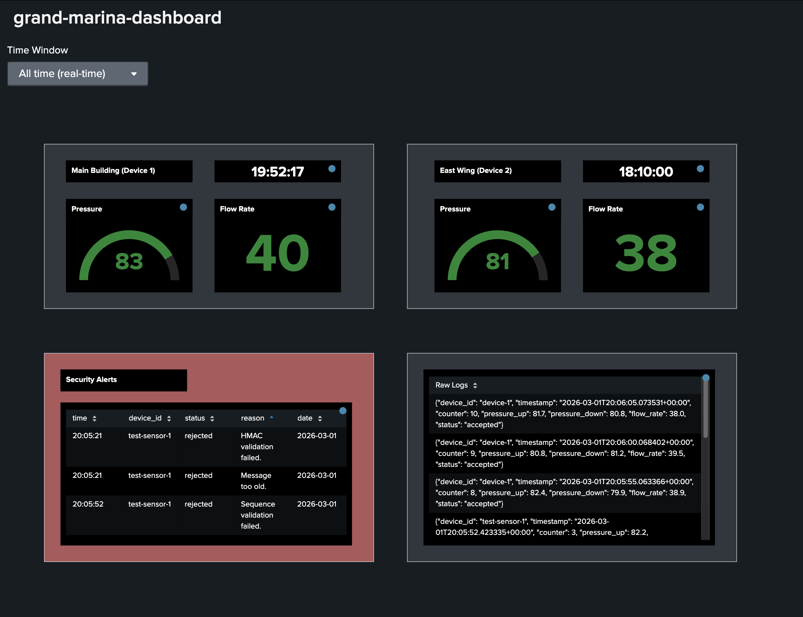

# Splunk Dashboard

# Security Added to Pipeline
* Live monitoring of sensor readings to check if pressure, flow rate exceeds or falls below a certain range.
* Security alerts about rejected messages / attack attempts..

# How it Works
1. Subscriber appends received messages to messages.json file. 
2. Splunk monitors this json file and ingests new readings. 
3. Splunk uses SPL queries to display data in dashboard.

# Activate live monitoring
1. Splunk:
    * Download Splunk Enterprise
    * Create index: grand-marina-hotel
    * Set up messages.json local file monitoring and dump to grand-marina-hotel index.
    * Import dashboard: splunk_dashboard.json
2. Run mosquitto broker
3. Run [subscriber.py](subscriber.py)
4. Run [publisher_device1.py](publisher_device1.py) and [publisher_device2.py](publisher_device2.py) to view live readings.
5. Run simulate_attacks.py to view security alerts.